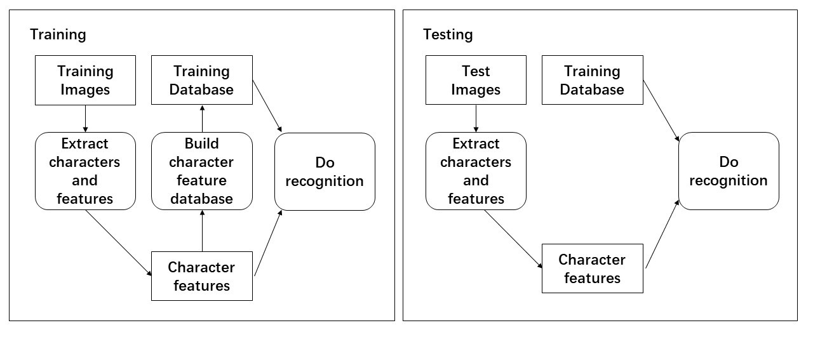

#### Simple Optical Character Recognition System for hand-written Characters

**Problem Overview**

Given grayscale images of hand-written characters, where you will need to **identify** (extract) and **recognize** (classify) each character.

The Assignment has two phases: **Training** and **Recognition**. After completing these, you will be asked to improve the recognition rates by providing your own ideas, which is the **enhancement** part.

For both training and recognition, you will need to convert the grayscale images to binary images, identify each separate character instances appearing in the image and extract some visual features from these character instances.

In the training phase, you will build (learn) a 'database' of features that you extracted from a given set of character images. These features will put inside a matrix that will be later used as a recognition database. At this phase you will know what each character is (its label) and you will also store this information along with the extracted features.

In the recognition phase, you will use the build database of features, the associated character labels and the features you extracted from your test images to recognize each character in this test image. Features extracted for each character instance in the test image will be compared to all the features in the database and the label of the 'best' matching character instance in the database will be the recognition result for this test character instance (this is called nearest neighbor classifier).

For crosscheck you will also be performing the same recognition step for the training images and measure the how well you have performed. This way you will know if your features are descriptive enough for your characters and you will also have the chance to catch possible errors in your implementation earlier.

#### Project Guideline

**1 Training**

​	**1.1 Importing necessary Python modules**

​	**1.2 Reading Images and Binarization**

- Reading an Image File
- Visualizing an Image/Matrix
- Image Histogram
- Binarization by Thresholding
- Displaying Binary Image

​        **1.3 Extracting Characters and Their Features**

- Connected Component Analysis
- Displaying Component Bounding Boxes
- Computing Hu Moments and Removing Small Components
- Storing Features

​	**1.4 Building Character Features Database for Recognition**

- Creating a File to Process Each Image  *train.py*
- Normalization
- Recognition on Training Data (Euclidean distance)
- Confusion Matrix

**2 Testing (Recognition)**

​	**2.1 Reading Image and Binarization** *test.py*

​	**2.2 Extracting Characters and Their Features**

​	**2.3 Enhancements**

#### Script Description:

*train.py* implements the train process introduced above.

*RunMyOCRRecognition.py* make enhancements, and consolidated the *train.py*, serve as an improvement.

*test.py* did the Testing (Recognition) part.

#### Appendix

**Hu Moments** 

See the introduction in Wikipedia [link](<https://en.wikipedia.org/wiki/Image_moment>)

**Enhancement Ideas**

- Automate the threshold selection process: instead of a fixed hard-coded threshold, find methods that analyze the images and find the best threshold
- Use binary morphology: Using binary morphology might be useful if you have fragmented characters that you cannot get rid of solely by improving the thresholding. There could be many other uses for binary morphology
- Investigate different shape and region descriptors to extract invariant features to be used in the recognition: More invariant moments, shape profiles, contour descriptors, etc. Make sure you perform a meaningful normalization on each new feature you included. Sometimes you will not need to normalize a feature using mean and variance, but maybe using its known bounds.
- Use a better classifier. Instead of the nearest neighbor (closest distance) from the features' database for recognition, you can find the k-nearest neighbors (k is small number 3, 5, 7) and do a majority vote. 